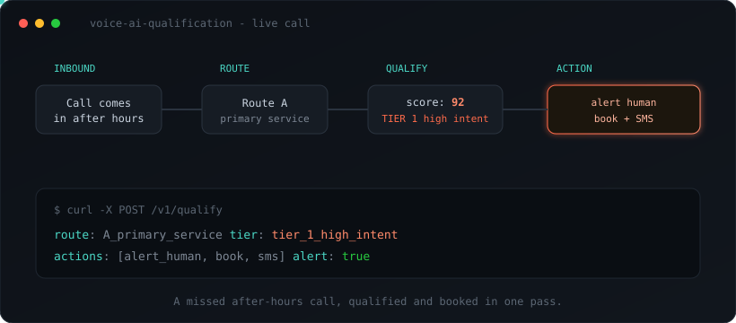
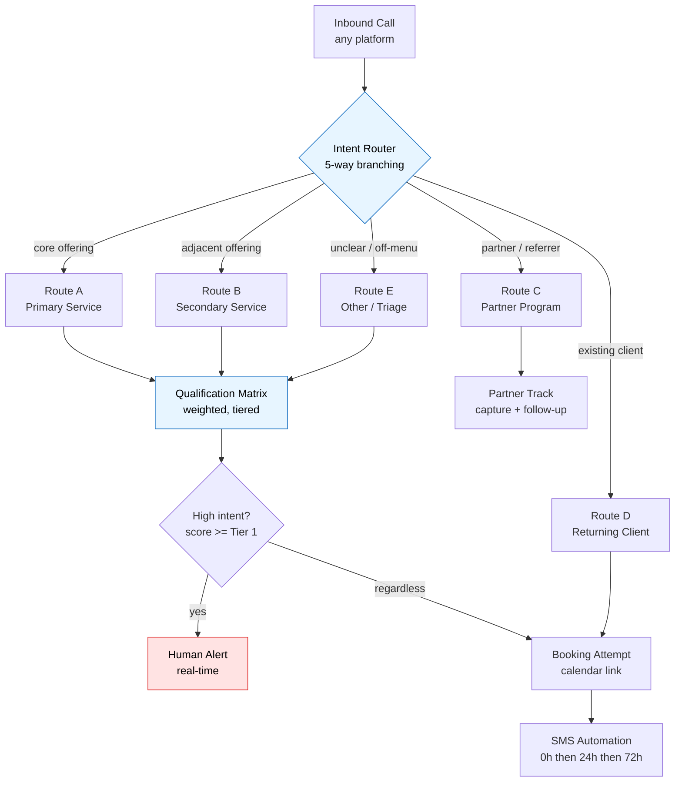
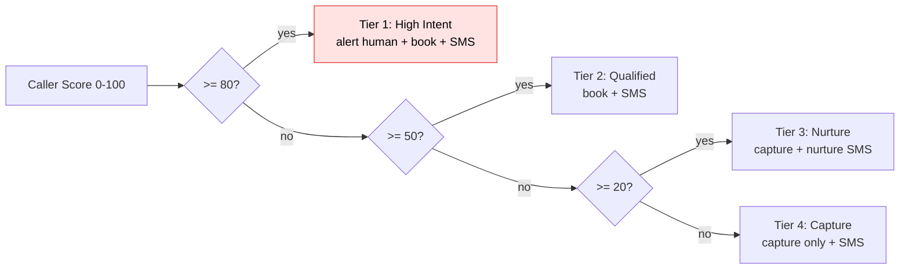

# Voice AI Qualification Engine




**A production-grade, platform-agnostic configuration framework for inbound voice AI agents that qualify callers, route them intelligently, and convert missed calls into booked meetings — without losing a single lead.**

[](./LICENSE)
[](https://github.com/michaelabera/voice-ai-qualification/actions/workflows/ci.yml)
[](./tests)
[](./config/agent_config.yaml)
[](./config/qualification_schema.json)
[](./CONTRIBUTING.md)

> A reusable blueprint for the most common voice-AI deployment in 2026: an agent that answers every inbound call, runs a short qualification sequence, books qualified callers, and alerts a human to the hot ones. Bring your own telephony (Vapi, Retell, Bland, Synthflow, Twilio, or similar); this brings the decision logic.

---

## Why this matters now

Voice AI crossed the line from demo to production in 2026. A few numbers that frame the demand this pattern serves:

- The conversational-AI market is on a steep multi-year growth curve, with inbound call automation one of its largest segments.
- A human-handled inbound call costs several dollars; an AI-handled one costs cents — the gap is the entire business case.
- The canonical production use case the whole industry now converges on is *inbound lead qualification*: answer within a second, ask 4–6 qualifying questions, update the CRM, and route the qualified caller onward.

The platforms to *run* an agent are mature and competitive. What's still scarce — and what separates a flaky demo from a deployment a business trusts — is the **decision architecture**: how the agent routes mixed inbound traffic, scores intent, protects business logic, and guarantees follow-up. That architecture is what this repository provides, vendor-neutral and ready to adapt.

---

## What it does

- **Routes every caller down one of five paths** based on intent, not a linear script
- **Qualifies in real time** against a tiered, weighted scoring matrix
- **Separates internal business logic from caller-facing language** so the agent never leaks how the business is compensated
- **Fires a high-intent alert to a human** the moment a caller crosses a value threshold — whether or not they book
- **Guarantees follow-up** with an SMS cadence at 0h, 24h, and 72h, with exit conditions
- **Handles the messy edges**: voicemail, returning clients, partners, and unclear intent — *no caller is ever a dead end*

---

## See it run

The decision logic is real, testable code — not slideware. Clone and run the demo:

```bash
git clone https://github.com/michaelabera/voice-ai-qualification.git
cd voice-ai-qualification
python src/router.py --demo
```

Expected output (abbreviated):

```text
High Intent  -> {"route": "A_primary_service", "score": 98, "tier": "tier_1_high_intent", "actions": ["alert_human", "book", "sms"], "alert_human": true}
Qualified    -> {"route": "A_primary_service", "score": 60, "tier": "tier_2_qualified", "actions": ["book", "sms"], "alert_human": false}
Nurture      -> {"route": "A_primary_service", "score": 30, "tier": "tier_3_nurture", "actions": ["capture", "sms_nurture"]}
Returning    -> {"route": "D_returning_client", "actions": ["fast_path_human", "sms"]}
Partner      -> {"route": "C_partner_program", "actions": ["capture_partner", "partner_followup"]}
Unclear      -> {"route": "E_other_triage", "score": 0, "tier": "tier_4_capture", "actions": ["capture_only", "sms"]}
```

> **Tip for recruiters / evaluators:** the whole system is legible in three files — `config/agent_config.yaml` (the agent's brain), `config/qualification_schema.json` (the scoring model), and `src/router.py` (the runnable logic). Five minutes end to end.

---

## Architecture



Qualification tiers and their actions:



Full reasoning in [`docs/ARCHITECTURE.md`](./docs/ARCHITECTURE.md); route-by-route detail in [`docs/CALL_FLOW.md`](./docs/CALL_FLOW.md).

---

## Repository map

| Path | What it is |
|------|-----------|
| [`config/agent_config.yaml`](./config/agent_config.yaml) | Complete agent configuration: persona, 5 routes, internal-context block, SMS cadence, rules. Tokenized. |
| [`config/qualification_schema.json`](./config/qualification_schema.json) | JSON Schema for the qualification data model and tier thresholds. |
| [`src/models.py`](./src/models.py) | Pydantic v2 models — type-safe caller, signals, decision, and analytics event. |
| [`src/router.py`](./src/router.py) | Reference implementation of the intent router and qualification scorer. |
| [`src/sms_cadence.py`](./src/sms_cadence.py) | Follow-up cadence engine (0h / 24h / 72h) with exit conditions. |
| [`src/server.py`](./src/server.py) | **FastAPI webhook server** — live `/v1/qualify`, `/health`, `/metrics`, `/v1/analytics`. |
| [`src/analytics.py`](./src/analytics.py) | Aggregates call outcomes into conversion-by-tier and score distribution. |
| [`src/ab_test.py`](./src/ab_test.py) | A/B harness for comparing scoring-weight variants. |
| [`src/validate_config.py`](./src/validate_config.py) | Pre-deploy config validator CLI (catches broken configs, unfilled tokens). |
| [`src/logging_utils.py`](./src/logging_utils.py) | Structured JSON logging with automatic PII redaction. |
| [`src/presets.py`](./src/presets.py) | Loads and merges vertical presets over the base config. |
| [`presets/`](./presets) | Vertical preset packs: healthcare, real estate, home services. |
| [`locales/`](./locales) | Caller-facing language strings (en, es) — logic stays language-agnostic. |
| [`tools/config-builder/`](./tools/config-builder) | **No-code web UI** that generates a valid config in the browser. |
| [`tests/`](./tests) | 37-test pytest suite across routing, scoring, server, analytics, presets, redaction. |
| [`docs/ARCHITECTURE.md`](./docs/ARCHITECTURE.md) | Design decisions and the reasoning behind them. |
| [`docs/CALL_FLOW.md`](./docs/CALL_FLOW.md) | The five routes, step by step. |
| [`docs/INTEGRATIONS.md`](./docs/INTEGRATIONS.md) | How to wire it to a real platform (calendar, CRM, SMS, email). |
| [`docs/COMPLIANCE.md`](./docs/COMPLIANCE.md) | Recording consent, SMS opt-out, PHI/BAA guidance. |
| [`docs/DISTRIBUTION.md`](./docs/DISTRIBUTION.md) | Launch playbook for driving attention to the repo. |
| [`Dockerfile`](./Dockerfile) + [`docker-compose.yml`](./docker-compose.yml) | One-command containerized run. |

## Run it as a live service

```bash
pip install -r requirements.txt
uvicorn server:app --app-dir src --port 8000
# or: docker compose up --build

curl localhost:8000/health
curl -X POST localhost:8000/v1/qualify -H 'content-type: application/json' \
  -d '{"signals":{"intent_clarity":1,"fit_threshold":1,"timeline":1,"decision_power":1}}'
# -> {"route":"A_primary_service","score":100,"tier":"tier_1_high_intent","actions":["alert_human","book","sms"],"alert_human":true}
```

Point your voice platform's webhook at `POST /v1/qualify`. Prometheus metrics are
at `/metrics`; a live analytics summary is at `/v1/analytics`.

## Build a config without code

Open [`tools/config-builder/index.html`](./tools/config-builder) in any browser
to generate a valid `agent_config.yaml` with sliders for scoring weights and
vertical presets. Nothing leaves the browser.

---

## The five-route call flow

| Route | Trigger | Goal |
|-------|---------|------|
| **A — Primary Service** | Caller wants the core offering | Qualify → book |
| **B — Secondary Service** | Caller wants the adjacent offering | Qualify → book or nurture |
| **C — Partner Program** | Caller is a partner/referrer, not a buyer | Capture → partner track |
| **D — Returning Client** | Caller is already in the system | Skip qualification, fast-path |
| **E — Other / Triage** | Intent unclear or off-menu | Capture, never deprioritize, hand off |

Core principle: **no caller is ever a dead end.** Even Route E captures contact data and triggers follow-up.

---

## Design principles

1. **Separate internal logic from caller language.** The agent knows the business model; the caller hears only their own benefit.
2. **Qualification is a gradient, not a gate.** Low-intent callers are captured and nurtured, never hung up on.
3. **The booking is the goal, not the finish line.** Every call ends with an SMS; every un-booked call enters a cadence.
4. **Humans handle the high-value moments.** The system surfaces the right caller to the right person at the right time.
5. **Platform-agnostic by design.** Logic lives in config and code, never locked inside one vendor's UI.

---

## Adapt it to your vertical

Built originally for financial advisory, the structure is vertical-agnostic. Swap the route definitions and scoring criteria:

- **Home services** — route by job type, qualify by project size
- **Healthcare intake** — route by service line, qualify by urgency (request a BAA from your platform for PHI)
- **Real estate** — route by buy/sell/rent, qualify by timeline + budget
- **Agencies** — route by service, qualify by budget + fit

---

## Quick start

```bash
# 1. Clone and install dev deps
git clone https://github.com/michaelabera/voice-ai-qualification.git
cd voice-ai-qualification
pip install -r requirements-dev.txt

# 2. Copy the config and fill in your tokens
cp config/agent_config.yaml config/agent_config.local.yaml
#    replace every {{PLACEHOLDER}} with your real values
#    (config/*.local.yaml is gitignored so secrets never get committed)

# 3. Run the tests and the demo
pytest -q
python src/router.py --demo
python src/sms_cadence.py --demo
```

Then load `agent_config.local.yaml` into your voice platform as the system prompt / knowledge base, and wire the cadence into your messaging provider. See [`docs/INTEGRATIONS.md`](./docs/INTEGRATIONS.md).

---

## What this is — and isn't

This repository is a **generic systems-design pattern authored by the maintainer**, demonstrating how to architect an inbound voice-qualification agent. It is deliberately abstract:

- It contains **no company's proprietary content** — no real scripts, service descriptions, pricing, or client data. Every business-specific value is a `{{PLACEHOLDER}}` token.
- It does **not** include or depend on any specific vendor's software. Platform names are referenced only as examples of where this config can run.
- It represents *method and architecture*, not any single employer's confidential operations.

If you adapt it, the content you add is yours; keep proprietary or client-confidential material out of any public fork.

---

## Author

Built by **[@MichaelAberaAI](https://github.com/michaelabera)** — AI revenue systems and sales-automation architect, focused on turning manual sales operations into measurable, automated pipeline.

## License

[MIT](./LICENSE) — use it, fork it, ship it.
